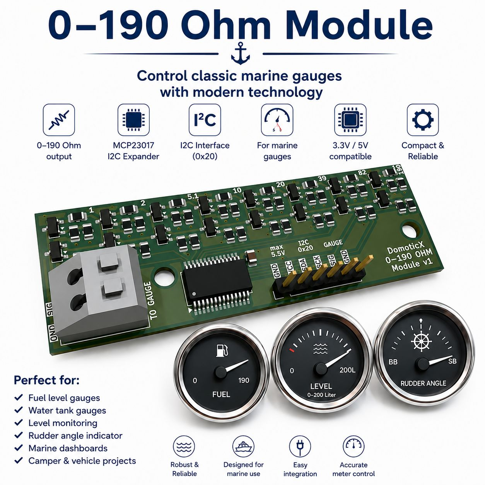
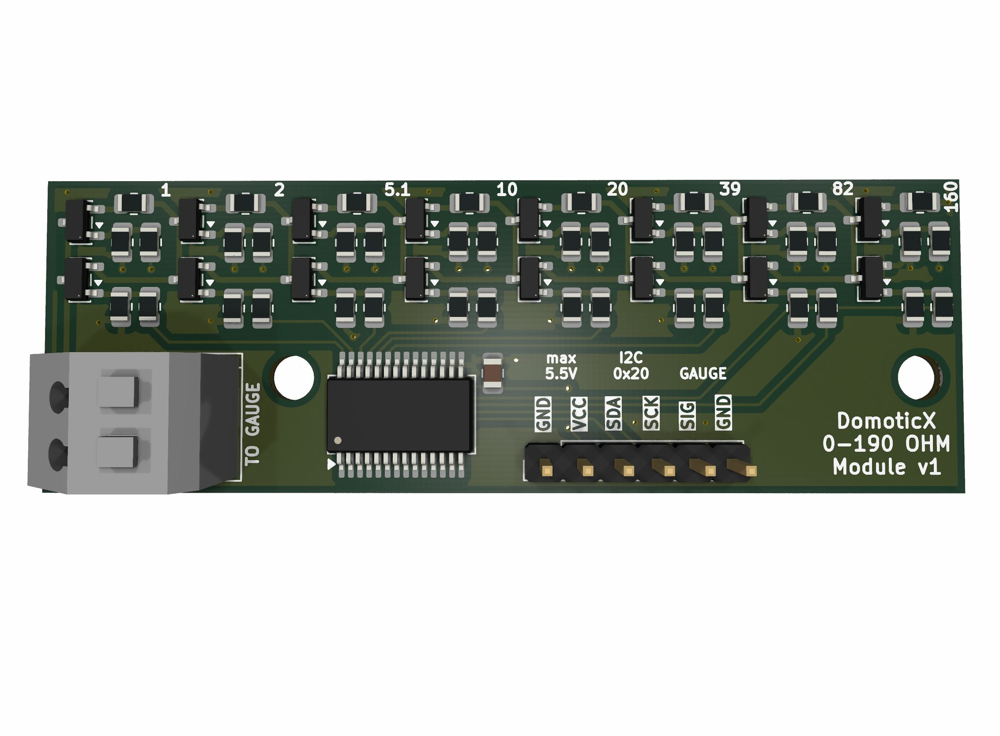
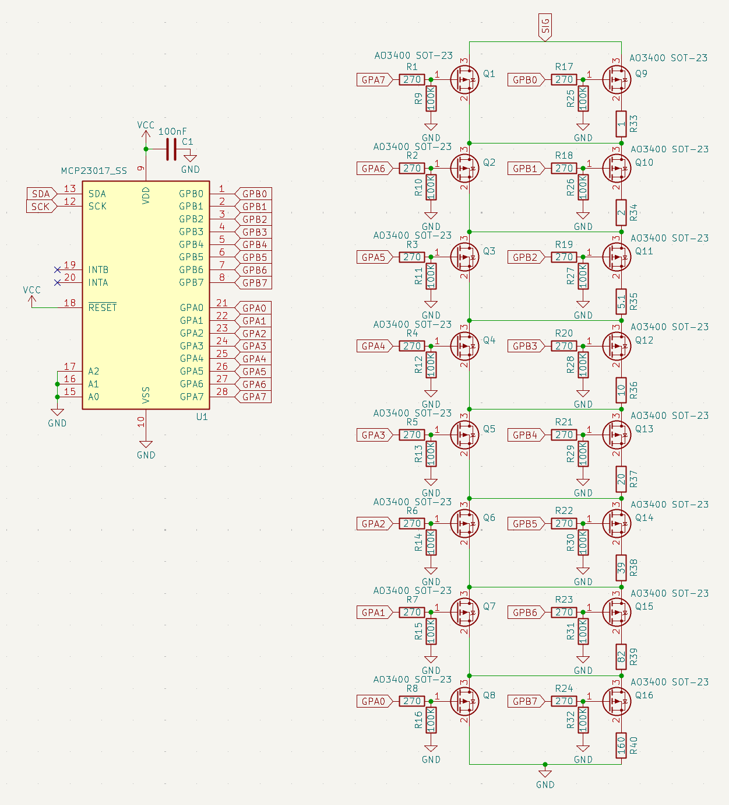

The DomoticX 0–190 Ohm Module is a compact interface board specifically designed for driving standard analog 0–190 Ohm marine gauges commonly used for:

- Fuel level gauges
- Water tank gauges
- Oil tank gauges
- Level indication systems
- Marine dashboard meters

The module uses a reliable MCP23017 I2C expander and is ideal for projects based on:

- Arduino
- ESP32
- Raspberry Pi
- PLC systems
- Home automation
- Custom onboard computer systems

---

## Features

- Supports standard 0–190 Ohm marine gauges
- I2C interface using MCP23017
- Fixed I2C address: `0x20`
- Compact PCB design
- Compatible with 3.3V and 5V microcontrollers
- Low microcontroller load
- Ideal for marine and vehicle projects
- Easy integration into existing systems

---

## Applications

Perfect for:

- Marine dashboards
- Boat fuel level indication
- Water tank monitoring
- Waste tank systems
- Camper and RV projects
- Embedded control systems
- DIY marine electronics

---

## Technical Specifications

| Specification | Value |
|---|---|
| Gauge Range | 0–190 Ohm |
| Communication | I2C |
| I2C Address | 0x20 |
| Controller IC | MCP23017 |
| Logic Voltage | 3.3V / 5V |
| Application | Analog marine gauges |

---

## Compatibility

The module can be used with:

- Arduino
- ESP8266
- ESP32
- Raspberry Pi
- STM32
- PLC controllers
- Other I2C-compatible systems

---

## Why This Module?

Classic marine gauges are robust and widely available, but interfacing them directly with modern electronics can be difficult.

This module provides a simple and reliable bridge between traditional analog marine instrumentation and modern embedded systems.

---

## Example Use Cases

- Smart marine dashboards
- Boat automation systems
- Tank monitoring systems
- DIY marine computer projects
- Vehicle telemetry
- Industrial level indication

---

## License

Open hardware / experimental project by DomoticX.

## Where to buy?

- [DomoticX Webshop](https://domoticx.net/webshop/)
- [0–190 Ohm Products](https://domoticx.net/?s=0%E2%80%93190+Ohm&post_type=product)

## Overview

## Schematic

